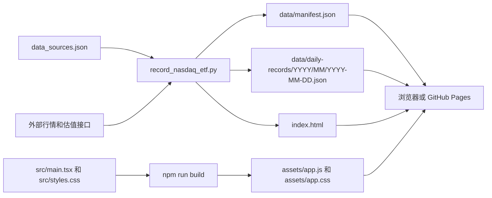

# Nasdaq ETF 跟踪项目交接文档

本文面向接手维护本项目的 Agent 或开发者。目标是让接手者不依赖历史对话，也能理解项目用途、数据口径、运行方式、更新流程和常见故障。

## 1. 项目概览

### 1.1 项目做什么

本项目每天记录两组纳斯达克 100 跟踪数据，并生成可直接部署到 GitHub Pages 的静态页面。

第一组是三只 A 股纳指 ETF：

- `513100`：纳指ETF国泰
- `159501`：纳指ETF嘉实
- `159659`：纳斯达克100ETF招商

记录内容包括：

- 中国市场交易日期
- 收盘价格
- 当天涨幅
- T-1 估值
- T-1 估值日
- 相对 T-1 估值的溢价率
- 当天分钟走势
- 实际使用的数据源

第二组是两个美股基准：

- `QQQ`：Invesco QQQ Trust
- `NDX`：Nasdaq 100 Index

记录内容包括：

- 跟踪日期
- 美股行情日期
- 收盘价或收盘点位
- 当天涨幅
- 历史最高收盘价或收盘点位
- 距历史最高收盘的回撤
- 历史最高收盘日期
- 美股常规交易时段走势
- 实际使用的数据源

### 1.2 项目不做什么

- 不提供实时交易信号。
- 不使用盘中最高价计算 QQQ/NDX 历史最高点。
- 不把 `node_modules` 部署到 GitHub Pages。
- 不依赖数据库，正式数据由按日期拆分的 JSON 文件保存。
- 不内置完整的中国和美国交易所节假日日历。

### 1.3 当前仓库信息

```text
本地目录：D:\DevProjects\Personal\codex-something\nasdaq-etf
默认分支：main
远程仓库：git@github.com:Auroka/nasdaq-etf.git
Pages 地址：https://auroka.github.io/nasdaq-etf/
```

截至 `2026-07-03 15:39:29` 的数据快照：

```text
每日文件：24 个
日期范围：2026-06-01 至 2026-07-03
ETF 记录：72 行
QQQ/NDX 记录：46 行
```

该快照只用于说明交接时状态。真实状态始终以 `data/manifest.json` 和 Git 提交记录为准。

## 2. 技术架构

### 2.1 技术栈

- 数据采集：Python 3.10+，只使用标准库，无 Python 第三方依赖。
- 页面：React 18 + TypeScript。
- 构建：esbuild。
- 数据存储：JSON 文件。
- 部署：GitHub Pages，直接发布 `main` 分支根目录。
- 自动执行：Codex Desktop 本地 Automation，工作日北京时间 `15:30` 触发。

### 2.2 数据流



页面加载顺序：

1. 浏览器打开 `index.html`。
2. `assets/app.js` 启动 React 应用。
3. React 读取 `data/manifest.json`。
4. React 根据 `daily_files` 并行读取每日 JSON。
5. 页面将数据合并后展示 ETF、QQQ/NDX 和数据源三个 tab。

## 3. 目录与文件职责

```text
nasdaq-etf/
  assets/
    app.css                         前端构建产物，必须提交
    app.js                          前端构建产物，必须提交
  data/
    manifest.json                   数据总索引，页面唯一数据入口
    daily-records/
      YYYY/
        MM/
          YYYY-MM-DD.json           每日正式数据
  docs/
    HANDOFF.md                      本交接文档
  scripts/
    build.mjs                       React/TypeScript 构建脚本
    refresh_yahoo_intraday_trends.ps1
                                     Yahoo 分钟数据 PowerShell 兜底
  src/
    main.tsx                        页面组件、数据加载、表格和折线图
    styles.css                      页面样式
    types.ts                        前端数据类型
  .gitignore                        本地文件忽略规则
  .nojekyll                         禁止 GitHub Pages 使用 Jekyll 处理
  CLAUDE.md                         Agent 项目规则
  data_sources.json                 跟踪标的和数据源配置
  index.html                        React 页面壳，生成文件
  package-lock.json                 Node 依赖锁文件
  package.json                      Node 脚本和依赖
  README.md                         项目简介和常用命令
  record_nasdaq_etf.py              数据采集、补录和写入主程序
  tsconfig.json                     TypeScript 配置
```

维护边界：

- 调整标的或接口：修改 `data_sources.json`。
- 调整采集、回填、口径或写入：修改 `record_nasdaq_etf.py`。
- 调整页面：修改 `src/`，然后重新构建 `assets/`。
- 不手工修改 `assets/app.js`、`assets/app.css`。
- 不把业务逻辑写进 `index.html`；它是生成的页面壳。
- 正式数据只使用 `data/manifest.json` 和 `data/daily-records/`。

## 4. 核心数据口径

### 4.1 ETF 溢价率

```text
溢价率 = ETF 收盘价格 / T-1 估值 - 1
```

例如溢价率 `0.0325` 在页面展示为 `+3.25%`。

注意：

- `daily_change`、`premium` 和 `drawdown` 在 JSON 中都保存为小数比例，不保存为百分数字符串。
- T-1 估值必须同时记录实际估值日期。
- 历史补录时如果估值日期不匹配，不得拿当前估值替代历史估值。

### 4.2 QQQ/NDX 历史最高点与回撤

```text
回撤 = 当前收盘价或点位 / 截至行情日的历史最高收盘价或点位 - 1
```

关键规则：

- 历史最高点按收盘价统计，不使用盘中最高价。
- `history_high` 的统计范围截止到当前记录的 `quote_date`。
- `history_high_date` 是产生历史最高收盘的日期。
- 当前值等于历史最高收盘时，回撤为 `0`。

### 4.3 跟踪日期与行情日期

QQQ/NDX 有两个日期，不能混用：

- `track_date`：中国市场观察和记录这条数据的日期。
- `quote_date`：QQQ/NDX 实际收盘行情所属的美股日期。

日常执行时，脚本以中国日期减一天作为美股查询上限，再选择不晚于该上限的最新有效美股收盘日。因此：

- `track_date` 与 `quote_date` 通常相差一天。
- 遇到周末或美国休市日，二者可能相差多天。
- QQQ/NDX 记录按 `quote_date` 存入每日文件，不按 `track_date` 存储。

示例：`track_date` 为 `2026-07-03` 的 QQQ/NDX 记录，`quote_date` 为 `2026-07-02`，因此记录位于：

```text
data/daily-records/2026/07/2026-07-02.json
```

所以 `2026-07-03.json` 中 `benchmark_records` 为空，不表示 `2026-07-03` 的跟踪任务漏记。

### 4.4 分钟走势

每条走势最多保留 `64` 个点，目的是控制每日 JSON 大小，同时保留走势形状。

ETF：

- 走势日期必须等于 `trade_date`。
- 收盘点统一为 `15:00`。
- 最终点数值必须与 ETF 表格的 `price` 一致。
- 新浪分钟数据只有覆盖 `09:35` 至 `15:00` 才会被接受。

QQQ/NDX：

- 走势日期必须等于 `quote_date`。
- Nasdaq 数据只保留美东时间 `9:30 AM` 至 `4:00 PM` 的常规交易时段。
- 最终点统一为 `4:00 PM`。
- 最终点数值必须与表格的 `value` 一致。

代码会强制将最终点对齐到表格收盘值。维护者仍应检查走势日期、时间范围和大体形状，因为“最终点一致”不代表整段走势一定来自正确交易日。

## 5. 数据文件结构

### 5.1 `data/manifest.json`

主要字段：

```json
{
  "generated_at": "2026-07-03 15:39:29",
  "etfs": [],
  "benchmarks": [],
  "sources": [],
  "daily_files": [
    {
      "date": "2026-07-03",
      "file": "daily-records/2026/07/2026-07-03.json",
      "etf_count": 3,
      "benchmark_count": 0
    }
  ]
}
```

规则：

- `daily_files` 按日期倒序排列。
- `file` 相对于 `data/manifest.json` 所在目录。
- `etf_count` 和 `benchmark_count` 必须与对应文件数组长度一致。
- 前端只读取清单中列出的文件，磁盘上未被清单引用的 JSON 不会展示。

### 5.2 每日 JSON

文件路径：

```text
data/daily-records/YYYY/MM/YYYY-MM-DD.json
```

结构：

```json
{
  "date": "2026-07-02",
  "etf_records": [],
  "benchmark_records": []
}
```

ETF 行关键字段：

| 字段 | 含义 |
| --- | --- |
| `trade_date` | 中国 ETF 交易日期，也是 ETF 文件归档日期 |
| `recorded_at` | 该行最后一次写入时间，北京时间 |
| `code` | ETF 代码 |
| `name` | ETF 名称 |
| `price` | 收盘价格 |
| `daily_change` | 当天涨幅，小数比例 |
| `estimate` | T-1 估值 |
| `premium` | 溢价率，小数比例 |
| `quote_time` | ETF 行情时间，仅保留在数据文件中 |
| `estimate_time` | 实际估值日期或时间 |
| `source_ids` | 本行数据源 ID 列表 |
| `trend` | 分钟走势；无可用走势时为 `null` |

QQQ/NDX 行关键字段：

| 字段 | 含义 |
| --- | --- |
| `track_date` | 中国市场跟踪日期 |
| `recorded_at` | 该行最后一次写入时间，北京时间 |
| `symbol` | `QQQ` 或 `NDX` |
| `value` | 收盘价格或点位 |
| `daily_change` | 相对前一有效收盘日涨幅，小数比例 |
| `history_high` | 截至 `quote_date` 的历史最高收盘 |
| `drawdown` | 距最高收盘回撤，小数比例 |
| `history_high_date` | 最高收盘日期 |
| `quote_date` | 实际美股行情日期，也是基准记录归档日期 |
| `unit` | `USD` 或 `points` |
| `source_ids` | 本行数据源 ID 列表 |
| `trend` | 常规交易时段走势；无可用走势时为 `null` |

### 5.3 去重键

脚本不是简单追加，而是按以下键覆盖更新：

```text
ETF：trade_date + code
QQQ/NDX：quote_date + symbol
```

重复运行同一日期不会产生重复行。注意 QQQ/NDX 的覆盖键不包含 `track_date`，同一 `quote_date + symbol` 只能保留一条记录。

## 6. 数据源与回退顺序

完整接口地址和标的配置以 `data_sources.json` 为唯一准确信息。

### 6.1 当日 ETF 表格数据

| 数据 | 首选 | 备用 |
| --- | --- | --- |
| 价格、涨幅、行情日期 | `eastmoney_quote` | `tinyright_table` |
| T-1 估值和估值日 | `tinyright_t1` | 无静默替代，缺失则失败 |

脚本优先采用接口直接给出的溢价率；接口未提供时按 `price / estimate - 1` 计算。

### 6.2 历史 ETF 补录

| 数据 | 顺序 |
| --- | --- |
| 历史收盘和涨幅 | `eastmoney_kline` -> `sina_daily_kline` |
| 历史估值 | `tinyright_t1` 日期匹配 -> `tinyright_iopv` 日期匹配 -> `eastmoney_fund_nav` |

任何估值兜底都必须匹配目标估值日期。全部不匹配时脚本应失败，不得写入猜测值。

### 6.3 ETF 分钟走势

```text
eastmoney_trend
  -> tencent_minute（只用于执行当天）
  -> sina_minute_kline
  -> yahoo_intraday_chart
```

Yahoo 兜底默认开启。临时禁用：

```powershell
$env:NASDAQ_ETF_ENABLE_YAHOO_INTRADAY = "0"
python record_nasdaq_etf.py --refresh-trends
Remove-Item Env:NASDAQ_ETF_ENABLE_YAHOO_INTRADAY
```

### 6.4 QQQ/NDX 日线与回撤

```text
nasdaq_api_historical
  -> yahoo_chart
  -> 在目标日缺口处再次尝试 Nasdaq historical/chart
```

历史最高点由完整历史收盘序列计算。Nasdaq 官方历史接口是首选，Yahoo 是备用源。

### 6.5 QQQ/NDX 分钟走势

```text
nasdaq_api_chart
  -> yahoo_intraday_chart
```

Nasdaq chart 会过滤盘前和盘后数据。Yahoo 数据作为备用时，最终点仍会与正式收盘值对齐。

## 7. 首次接手与本地启动

### 7.1 环境准备

```powershell
cd D:\DevProjects\Personal\codex-something\nasdaq-etf
python --version
node --version
npm --version
npm ci
```

要求：

- Python 3.10 或更高版本。
- Node.js 可运行当前锁文件中的 React、TypeScript 和 esbuild。
- 数据接口需要网络访问。
- Git SSH 已能访问 `git@github.com:Auroka/nasdaq-etf.git`。

`node_modules` 被 `.gitignore` 忽略。GitHub Pages 运行的是已提交的静态产物，不需要服务器端安装 Node 依赖。

### 7.2 先做只读检查

```powershell
git status --short --branch
git remote -v
git log -5 --oneline
Get-Content -Raw -Encoding utf8 .\data\manifest.json | ConvertFrom-Json |
  Select-Object generated_at, @{Name="daily_file_count"; Expression={$_.daily_files.Count}}
```

如果工作区已有未提交改动，先判断改动来源。不要重置、覆盖或删除其他 Agent 或用户留下的改动。

### 7.3 本地查看页面

```powershell
python -m http.server 5173
```

访问：

```text
http://127.0.0.1:5173/
```

必须通过 HTTP 打开。直接双击 `index.html` 使用 `file://` 时，浏览器可能禁止页面读取 JSON。

## 8. 每日数据更新标准流程

推荐在中国交易日北京时间 `15:30` 后执行。脚本的硬性时间检查是 `15:00`，但 `15:30` 更容易拿到完整分钟走势。

### 8.1 执行前

```powershell
cd D:\DevProjects\Personal\codex-something\nasdaq-etf
git status --short --branch
git pull --ff-only origin main
```

只有工作区状态允许时才执行 `git pull --ff-only`。存在本地改动时先理解和保留这些改动。

### 8.2 采集当天数据

```powershell
python record_nasdaq_etf.py
```

输出含义：

- `recorded ...`：数据已写入或覆盖，可以进入验证。
- `skipped: market has not closed yet`：执行时间早于 `15:00`。
- `skipped: ... quote date is ..., not ...`：ETF 行情日期不是当前日期，通常是休市、接口延迟或错误行情。
- `skipped: today is not a weekday`：周六或周日。
- `failed: ...`：接口、字段、估值日期或网络请求失败，不能提交不完整数据。

不要使用 `--force` 绕过日期检查来完成普通日常记录。`--force` 只适合已经人工确认所有行情日期和数据内容的恢复场景。

### 8.3 检查改动

```powershell
git status --short
git diff --stat
git diff -- data\manifest.json
```

检查最新每日文件：

```powershell
$manifest = Get-Content -Raw -Encoding utf8 .\data\manifest.json | ConvertFrom-Json
$latest = $manifest.daily_files | Select-Object -First 1
$latest
Get-Content -Raw -Encoding utf8 (Join-Path .\data $latest.file)
```

至少确认：

- 当前中国交易日有且只有 `3` 条 ETF。
- ETF 代码为 `513100`、`159501`、`159659`。
- `trade_date`、`quote_time` 和走势日期一致。
- `estimate_time` 是实际 T-1 估值日。
- `premium` 满足 `price / estimate - 1`。
- QQQ/NDX 各有一条记录，并且 `quote_date` 是最近有效美股收盘日。
- `history_high` 和 `drawdown` 使用收盘价口径。
- ETF 最后一个走势点为 `15:00` 且等于 `price`。
- QQQ/NDX 最后一个走势点为 `4:00 PM` 且等于 `value`。
- `source_ids` 与实际来源相符。

### 8.4 校验 JSON、Python 和前端

```powershell
Get-Content -Raw -Encoding utf8 .\data\manifest.json | ConvertFrom-Json | Out-Null
Get-ChildItem .\data\daily-records -Recurse -Filter *.json | ForEach-Object {
  Get-Content -Raw -Encoding utf8 $_.FullName | ConvertFrom-Json | Out-Null
}
python -m py_compile record_nasdaq_etf.py
npm run typecheck
npm run build
```

日常数据更新没有修改前端源码时，`npm run build` 通常不会产生新内容，但执行它可以验证静态产物仍可构建。

### 8.5 提交并推送

只有确认数据正确且 `git diff` 是本次预期改动后才提交。

```powershell
git add index.html data\manifest.json data\daily-records
git diff --cached --stat
git commit -m "Record Nasdaq tracking YYYY-MM-DD"
git push origin main
```

规则：

- `YYYY-MM-DD` 使用本次中国跟踪日期。
- 没有实际 Git 变化时不创建空提交。
- 不顺手提交无关文件。
- 推送后用 `git status --short --branch` 确认工作区和远端关系。

## 9. 历史工作日补录

### 9.1 先识别缺口

`data/manifest.json` 只能说明已经记录了哪些日期，不能判断某个工作日是否为交易所休市日。补录前应结合交易所日历或可靠行情源确认真实交易日。

快速列出已有日期：

```powershell
$manifest = Get-Content -Raw -Encoding utf8 .\data\manifest.json | ConvertFrom-Json
$manifest.daily_files | Sort-Object date | Select-Object date, etf_count, benchmark_count
```

注意：

- `benchmark_count = 0` 不一定是缺口，QQQ/NDX 可能按前一个 `quote_date` 存在另一文件中。
- 判断 QQQ/NDX 是否漏记，应检查所有 `benchmark_records` 的 `track_date` 和 `quote_date`，不能只看文件名。
- 脚本不自动补齐一个日期区间，每个确认后的交易日需要单独执行。

### 9.2 同时补 ETF 和 QQQ/NDX

```powershell
python record_nasdaq_etf.py --backfill-date 2026-06-01
```

该命令会：

1. 获取指定中国交易日的三只 ETF 历史收盘和涨幅。
2. 查找该跟踪日对应的最近有效美股行情。
3. 使用该美股行情日作为历史估值目标日期。
4. 获取匹配日期的 T-1/IOPV，缺失时使用基金历史单位净值。
5. 计算 ETF 溢价率。
6. 生成或更新 ETF 和 QQQ/NDX 记录。
7. 尝试补分钟走势。

建议先预览：

```powershell
python record_nasdaq_etf.py --backfill-date 2026-06-01 --dry-run
```

`--dry-run` 会发起真实网络请求并打印结果，但不写入文件。

### 9.3 只补 QQQ/NDX 某个行情日

```powershell
python record_nasdaq_etf.py --backfill-benchmark-date 2026-06-12
```

默认 `track_date` 是该行情日后的下一个周一至周五日期。需要明确指定时：

```powershell
python record_nasdaq_etf.py --backfill-benchmark-date 2026-06-12 --track-date 2026-06-15
```

该命令只写日线、历史最高收盘和回撤，不主动获取分钟走势；随后执行：

```powershell
python record_nasdaq_etf.py --refresh-trends
```

### 9.4 批量补录原则

批量操作时仍应逐日执行并逐日检查，避免某个错误估值扩散到多个日期。示例：

```powershell
$dates = @("2026-06-01", "2026-06-02", "2026-06-03")
foreach ($date in $dates) {
  python record_nasdaq_etf.py --backfill-date $date
  if ($LASTEXITCODE -ne 0) { throw "Backfill failed: $date" }
}
```

日期列表必须来自已经确认的实际中国交易日，不要直接把所有周一至周五当作交易日。

## 10. 分钟走势补录与修复

### 10.1 补缺失走势

```powershell
python record_nasdaq_etf.py --refresh-trends
```

该命令主要补 `trend` 为空的记录，并尝试重新获取超过 `64` 点的旧走势。重新获取成功的走势最多保留 `64` 点；请求失败时保留原记录。已有且不超过 `64` 点的走势会被保留，即使它的形状有问题也不会自动替换。

### 10.2 Yahoo PowerShell 兜底

Python 客户端请求 Yahoo 被拒绝时：

```powershell
& .\scripts\refresh_yahoo_intraday_trends.ps1
```

该脚本同样只补缺失走势，不替换已经存在的走势。

### 10.3 修复“已有但错误”的走势

不要只看折线图是否有线。按以下顺序处理：

1. 找到目标 `quote_date` 或 `trade_date` 对应的每日 JSON。
2. 核对 `trend.date`、第一点、最后一点和 `source_ids`。
3. 先尝试重新运行对应日期的 `--backfill-date`。
4. 如果错误走势仍被保留，将目标行的 `trend` 设为 `null`，保持其他字段不变。
5. 运行 `python record_nasdaq_etf.py --refresh-trends`。
6. 再次核对完整时间范围和最终收盘点。
7. 只提交目标每日文件及随之更新的 `manifest.json`、`index.html`。

QQQ/NDX 也可以先执行：

```powershell
python record_nasdaq_etf.py --backfill-benchmark-date YYYY-MM-DD --track-date YYYY-MM-DD
python record_nasdaq_etf.py --refresh-trends
```

第一条命令会重建该行情日的基准行并让走势进入待补状态，第二条命令重新获取走势。

### 10.4 走势验收标准

ETF：

- `trend.date == trade_date`
- 点位按时间递增
- 包含上午和下午交易时段
- 最终时间为 `15:00`
- 最终值等于 `price`

QQQ/NDX：

- `trend.date == quote_date`
- 只保留常规交易时段
- 点位按时间递增
- 最终时间为 `4:00 PM`
- 最终值等于 `value`

## 11. 命令参考

| 命令 | 用途 | 是否写文件 |
| --- | --- | --- |
| `python record_nasdaq_etf.py` | 记录当前中国交易日 | 是 |
| `python record_nasdaq_etf.py --dry-run` | 预览当前数据 | 否 |
| `python record_nasdaq_etf.py --force` | 绕过星期、收盘时间和 ETF 行情日期检查 | 是，谨慎使用 |
| `python record_nasdaq_etf.py --init-only` | 按已有数据重建清单和页面壳 | 是 |
| `python record_nasdaq_etf.py --backfill-date YYYY-MM-DD` | 补 ETF 和对应 QQQ/NDX | 是 |
| `python record_nasdaq_etf.py --backfill-benchmark-date YYYY-MM-DD` | 只补某个美股行情日 | 是 |
| `python record_nasdaq_etf.py --track-date YYYY-MM-DD` | 配合基准补录指定跟踪日期 | 是 |
| `python record_nasdaq_etf.py --refresh-benchmarks` | 重算已有基准行并补部分缺口 | 是 |
| `python record_nasdaq_etf.py --refresh-trends` | 补缺失分钟走势 | 是 |
| `python record_nasdaq_etf.py --output PATH` | 指定页面输出路径 | 取决于其他参数 |
| `python record_nasdaq_etf.py --data-output PATH` | 指定数据索引输出路径 | 取决于其他参数 |
| `python record_nasdaq_etf.py --source-config PATH` | 指定数据源配置 | 取决于其他参数 |

`--refresh-benchmarks` 的边界：

- 会重算现有 QQQ/NDX 记录的收盘、涨幅、历史最高收盘和回撤。
- 会尝试为已有 ETF 日期补基准记录。
- 不会凭空创建不在当前数据集日期范围内的孤立历史文件。
- 为避免不必要请求，不主动刷新已有分钟走势。

## 12. 前端开发与 GitHub Pages

### 12.1 修改前端

修改：

```text
src/main.tsx
src/styles.css
src/types.ts
```

验证并构建：

```powershell
npm run typecheck
npm run build
```

构建结果：

```text
assets/app.js
assets/app.css
index.html
```

必须提交构建产物。GitHub Pages 不会自动执行 `npm install` 或 `npm run build`。

### 12.2 页面行为

- ETF 和 QQQ/NDX 通过 tab 切换。
- 表头和表格内容居中。
- 正涨幅和正溢价显示红色，负值显示绿色。
- 回撤为负值，按绿色显示并在表格上方突出展示。
- 折线图读取每行的 `trend.points`。
- 少于两个走势点时显示“未记录走势”。
- “最近更新”取所有记录中最大的 `recorded_at`。
- 页面加载数据时使用 `cache: "no-cache"`，但 GitHub Pages 或浏览器仍可能短暂保留旧静态文件。

### 12.3 Pages 配置

```text
Settings -> Pages -> Build and deployment
Source: Deploy from a branch
Branch: main
Folder: / (root)
```

访问：

```text
https://auroka.github.io/nasdaq-etf/
```

推送后页面仍显示旧数据时：

1. 确认 GitHub 上 `main` 已包含目标提交。
2. 确认 Pages 部署已完成。
3. 强制刷新浏览器缓存。
4. 直接打开对应 JSON URL，确认线上文件是否已经更新。

## 13. 自动任务

自动任务属于本机 Codex Desktop 状态，不在 Git 仓库中。

```text
Automation ID：etf-2
名称：纳指跟踪同线程记录
状态：ACTIVE
时区：Asia/Shanghai
计划：周一至周五 15:30
配置路径：C:\Users\Administrator\.codex\automations\etf-2\automation.toml
```

自动任务行为：

1. 在本项目执行 `python record_nasdaq_etf.py`。
2. 记录三只 ETF 和 QQQ/NDX。
3. 更新每日 JSON、`manifest.json` 和 `index.html`。
4. 有 Git 变化时使用 `Record Nasdaq tracking YYYY-MM-DD` 提交并推送。
5. 没有变化时不创建空提交。
6. 只在当前指定对话中报告结果。

注意：

- 周一至周五触发不等于当天一定是中国交易日，脚本会通过行情日期进行二次判断。
- Automation 依赖本机、Codex Desktop、网络、Git SSH 和目标对话状态。
- 新机器或其他 Agent 不能假设该 Automation 已存在。
- 调整自动任务时优先使用 Codex 的 automation 管理工具，不直接手改 TOML；只有管理工具不可用时才考虑人工处理。

## 14. 常见故障排查

### 14.1 `failed: request failed after retries`

含义：上游接口连续三次请求失败。

处理：

1. 记录报错 URL 中的数据源域名。
2. 稍后重试原命令。
3. 检查 `data_sources.json` 中接口地址是否仍有效。
4. 确认现有回退源是否被触发。
5. 不要把接口失败误当成空数据写入。

### 14.2 ETF 历史 K 线失败

脚本先请求东方财富，失败后自动使用新浪日 K。若两者都失败，补录终止。不要手工填入未经来源确认的收盘价。

### 14.3 `valuation date mismatch`

含义：Tinyright T-1 和 IOPV 的日期都不等于目标估值日，并且东方财富历史单位净值也没有该日期。

处理：

1. 确认目标 `trade_date` 和对应美股 `quote_date` 是否正确。
2. 核对基金该日是否有正式净值。
3. 重试接口。
4. 只有获得明确来源和日期一致的数据后再补录。

禁止用最近一天估值、当前估值或人工猜测值绕过。

### 14.4 价格和涨幅正确，但溢价率错误

按以下公式独立复算：

```text
price / estimate - 1
```

如果复算结果与 JSON 不一致，检查接口是否直接返回了错误 `premium`。当前当日流程优先使用 Tinyright 返回的 `premium`，缺失时才自行计算；必要时应修正代码，让写入口径统一，并重新生成目标日期数据。

### 14.5 页面没有走势

检查目标行：

```text
trend 是否为 null
trend.points 是否少于 2 个点
trend.date 是否匹配记录日期
```

缺失时执行 `--refresh-trends`。Yahoo 被阻止时执行 PowerShell 兜底脚本。

### 14.6 页面走势明显错误

不要只重复执行 `--refresh-trends`，因为已有且不超过 `64` 点的走势会被跳过。按“10.3 修复已有但错误的走势”处理，并核对源、日期、开收盘时间和最终值。

### 14.7 QQQ/NDX 出现盘前或盘后数据

Nasdaq chart 路径会过滤常规交易时段。若错误数据来自历史遗留或 Yahoo 兜底，清空目标 `trend` 后重新获取，并确认最终 JSON 只包含 `9:30 AM` 至 `4:00 PM`。

### 14.8 QQQ/NDX 最新日期看起来少一天

先区分 `track_date` 和 `quote_date`。中国时间下午执行时，美国当日尚未收盘，所以记录的是最近一个已收盘美股交易日，这是正常设计。

### 14.9 浏览器仍显示旧数据

依次检查：

1. 本地 JSON 是否更新。
2. `manifest.json` 是否引用目标文件。
3. 本地是否通过 HTTP 服务访问。
4. Git 提交是否已推送。
5. Pages 是否部署完成。
6. 浏览器是否需要强制刷新。

### 14.10 `npm run build` 后文件很多

预期只应改动：

```text
assets/app.js
assets/app.css
index.html
```

`node_modules` 不应进入 Git。先检查 `.gitignore` 和 `git status --short`，不要执行会覆盖用户改动的清理命令。

## 15. 质量门槛

### 15.1 修改 Python 后

```powershell
python -m py_compile record_nasdaq_etf.py
```

涉及数据源或解析逻辑时，再使用 `--dry-run` 或指定日期补录验证真实接口响应。

### 15.2 修改前端后

```powershell
npm run typecheck
npm run build
```

### 15.3 修改配置或数据后

- 所有 JSON 能被 UTF-8 解析。
- `manifest.json` 引用的文件全部存在。
- 每日文件中的 `date` 与文件名一致。
- ETF 每个交易日通常有三条且代码唯一。
- QQQ/NDX 同一 `quote_date` 下各一条且标的唯一。
- 百分比字段是数值比例，不是字符串。
- 走势最终点与表格收盘值一致。
- `source_ids` 能在 `data_sources.json` 中找到。
- `git diff` 不包含无关或意外文件。

### 15.4 文档同步

以下内容发生变化时必须同步更新文档：

- 标的、接口和回退顺序。
- 数据字段、公式和日期口径。
- 命令行参数。
- 目录结构和构建产物。
- 自动任务时间和行为。
- GitHub Pages 部署方式。

`README.md` 保持简洁，`CLAUDE.md` 保存 Agent 规则，本文件保存完整交接和操作细节。

## 16. 已知限制与维护风险

- 上游接口没有稳定性承诺，字段或访问策略可能变化。
- 项目没有自动化测试套件和 lint 命令，目前主要依赖编译、类型检查、JSON 校验和真实数据抽查。
- 脚本只识别周末，不内置交易所节假日日历。
- `--refresh-trends` 不会替换已存在且点数不超过 `64` 的错误走势。
- 每次页面加载会读取清单中的全部每日文件；数据规模显著增长后，需要考虑按月清单、分页或按需加载。
- 写入时会重建清单并写出所有已加载每日记录；手工删除清单引用前应同时检查是否留下未引用的孤立文件。
- QQQ/NDX 去重键为 `quote_date + symbol`，无法在同一美股行情日保留多个不同 `track_date` 版本。
- 自动任务是本机状态，不随 Git 仓库迁移。

## 17. Agent 接手检查清单

开始工作前：

- [ ] 使用 UTF-8 读取 `CLAUDE.md`、`README.md` 和本文件。
- [ ] 查看 `git status --short --branch`，保留现有改动。
- [ ] 查看 `data/manifest.json` 的 `generated_at`、日期范围和计数。
- [ ] 确认用户要求的是日常更新、历史补录、走势修复还是页面修改。
- [ ] 涉及当前或历史行情时，实际运行接口验证，不凭记忆填写。

数据写入后：

- [ ] 核对 ETF 三个代码和日期。
- [ ] 复算溢价率。
- [ ] 核对 QQQ/NDX 的 `track_date` 与 `quote_date`。
- [ ] 确认历史最高点按收盘价计算。
- [ ] 核对分钟走势日期、时间范围和最终值。
- [ ] 解析所有变更 JSON。
- [ ] 运行必要的 Python 编译或前端构建检查。
- [ ] 查看 `git diff`，只提交相关文件。
- [ ] 数据更新后按约定提交并推送。

遇到失败时：

- [ ] 保留原有正确记录。
- [ ] 明确报告是跳过、接口失败、估值日期不匹配还是走势缺失。
- [ ] 不使用错误日期、当前值或猜测值填补历史数据。
- [ ] 不通过删除校验或注释错误来制造成功结果。

## 18. 最短操作路径

日常更新：

```powershell
cd D:\DevProjects\Personal\codex-something\nasdaq-etf
python record_nasdaq_etf.py
git status --short
# 核对数据后
git add index.html data\manifest.json data\daily-records
git commit -m "Record Nasdaq tracking YYYY-MM-DD"
git push origin main
```

历史补录：

```powershell
python record_nasdaq_etf.py --backfill-date YYYY-MM-DD --dry-run
python record_nasdaq_etf.py --backfill-date YYYY-MM-DD
python record_nasdaq_etf.py --refresh-trends
```

前端修改：

```powershell
npm ci
npm run typecheck
npm run build
python -m http.server 5173
```

只要严格遵守日期口径、估值日期、收盘价历史高点和走势最终点四条规则，项目的数据就不会在“看起来正常”的情况下悄悄偏离真实含义。
